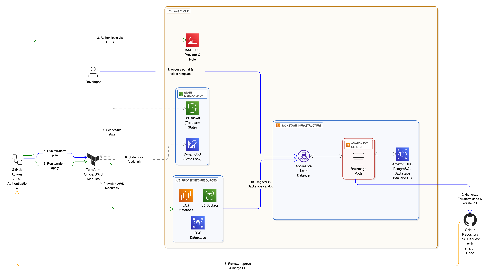

# Self Service Backstage Terraform IDP

An Internal Developer Platform (IDP) for self-service AWS resource provisioning using Backstage, Terraform, and GitHub Actions. This solution provides a solid foundation that can be customized for production use.

## 🎯 Overview

This repository provides a complete solution for developers to provision AWS resources (S3, EC2, RDS) through a user-friendly Backstage portal, without needing AWS Console access. Infrastructure is managed as code using Terraform with official AWS modules, following best practices and organizational policies.

**Key Benefits:**
- 🚀 **Self-Service** - Developers provision resources via UI, no AWS Console access needed
- 🔒 **Secure** - GitHub OIDC authentication, no long-lived credentials
- 📋 **Governed** - Pull Request workflow with platform team review
- ✅ **Best Practices** - Uses official AWS Terraform modules
- 🎯 **Standardized** - Consistent resource configuration across teams
- 📋 **Auditable** - Complete Git history of all infrastructure changes

## 🚀 Getting Started

### Prerequisites

- Existing EKS cluster (Kubernetes 1.29+)
- GitHub Personal Access Token
- AWS credentials

### Quick Deployment

Deploy in **10-20 minutes**

**→ [Start Here: Quick Start Guide](./docs/QUICK-START.md)**

## 👥 Who Is This For?

Platform Engineers • Developers • DevOps Teams • Security Teams • Engineering Managers

## 🎯 Key Features

### For Developers
- 🎨 **Self-Service Portal** - User-friendly Backstage interface
- 📋 **Form-Based Provisioning** - No AWS Console access needed
- 🚀 **Quick Resource Creation** - S3, EC2, RDS in minutes

### For Platform Teams
- 🔒 **Secure by Default** - GitHub OIDC, no long-lived credentials
- 📝 **PR-Based Approval** - Review all changes before deployment
- 📊 **Complete Audit Trail** - Git history of all infrastructure
- 🏗️ **Infrastructure as Code** - Official AWS Terraform modules
- ⚡ **Fast Deployment** - CloudFormation deployment in 10-20 minutes

## 🏗️ Architecture

### Components
- **Backstage** - Frontend portal for developers
- **GitHub** - Source control and CI/CD
- **GitHub Actions** - Automation engine
- **Terraform** - Infrastructure as Code (official AWS modules)
- **AWS** - Target cloud platform

### Architecture Diagram



**Key Components:**
- **Backstage Portal** - Self-service UI for developers
- **GitHub** - Source control and PR-based approval workflow
- **GitHub Actions** - CI/CD with OIDC authentication (no long-lived credentials)
- **Terraform** - Infrastructure as Code using official AWS modules
- **AWS Services** - EKS, RDS, ECR, S3, and provisioned resources (EC2, S3, RDS)

## 🔄 Workflows

### Developer Self-Service Workflow

```
Developer → Backstage Portal → Fill Template → GitHub PR Created
   ↓
GitHub Actions → terraform plan → Post plan to PR
   ↓
Platform Team → Review → Approve → Merge PR
   ↓
GitHub Actions → terraform apply → AWS Resource Created
```

**Key Points:**
- ✅ Developers use Backstage UI (no AWS Console access needed)
- ✅ GitHub Actions uses IAM role (no long-lived credentials)
- ✅ Platform team reviews via Pull Requests
- ✅ Complete audit trail in Git history


### Terraform Modules

Uses official AWS modules from [terraform-aws-modules](https://github.com/terraform-aws-modules):
- **EC2**: terraform-aws-modules/ec2-instance/aws ~> 5.0
- **S3**: terraform-aws-modules/s3-bucket/aws ~> 4.0
- **RDS**: terraform-aws-modules/rds/aws ~> 6.0
- **IAM**: terraform-aws-modules/iam/aws ~> 5.0
- **Security Groups**: terraform-aws-modules/security-group/aws ~> 5.0

### Security Architecture

```
┌──────────────────────────────────────────────────────┐
│                  GitHub Actions                       │
│                                                       │
│  ┌────────────────────────────────────────────────┐ │
│  │  1. Request temporary credentials via OIDC     │ │
│  └────────────────┬───────────────────────────────┘ │
└───────────────────┼───────────────────────────────────┘
                    │
                    ▼
┌──────────────────────────────────────────────────────┐
│                       AWS                             │
│                                                       │
│  ┌────────────────────────────────────────────────┐ │
│  │  2. OIDC Provider validates GitHub token       │ │
│  └────────────────┬───────────────────────────────┘ │
│                   │                                   │
│  ┌────────────────▼───────────────────────────────┐ │
│  │  3. STS assumes IAM role                       │ │
│  └────────────────┬───────────────────────────────┘ │
│                   │                                   │
│  ┌────────────────▼───────────────────────────────┐ │
│  │  4. Returns temporary credentials (15 min)     │ │
│  └────────────────┬───────────────────────────────┘ │
└───────────────────┼───────────────────────────────────┘
                    │
                    ▼
┌──────────────────────────────────────────────────────┐
│              Terraform Execution                      │
│  - No long-lived credentials                         │
│  - Scoped permissions                                │
│  - Audit trail via CloudTrail                        │
└──────────────────────────────────────────────────────┘
```

## 📁 Repository Structure

```
<repository-root>/
├── README.md                          # This file (overview)
│
├── backstage-setup/                   # ⚡ Backstage deployment
│   ├── README.md                      # Setup overview
│   ├── docs/                          # Documentation
│   │   ├── QUICK-START.md             # Quick deployment guide
│   │   └── DEPLOYMENT-GUIDE.md        # Comprehensive guide
│   ├── templates/                     # CloudFormation & Helm templates
│   │   ├── backstage-eks-stack.yaml   # CloudFormation template
│   │   └── helm-values.yaml           # Helm values
│   ├── scripts/                       # Deployment scripts
│   │   ├── quickstart.sh              # ONE COMMAND deployment
│   │   ├── setup-repo.sh              # Repository setup
│   │   ├── build-image.sh             # Build Docker image
│   │   └── deploy-backstage.sh        # Deploy to EKS
│   └── image/                         # Docker image configuration
│       ├── Dockerfile                 # Official Backstage Dockerfile
│       └── app-config.yaml            # Default configuration
│
├── backstage-templates/               # 📋 Backstage templates
│   ├── aws-ec2-instance/
│   ├── aws-s3-bucket/
│   └── aws-rds-instance/
│
├── terraform/                         # 🏗️ Terraform modules
│   ├── ec2/
│   ├── s3/
│   └── rds/
│
└── .github/workflows/
    └── terraform-apply.yml            # CI/CD pipeline
```

## 📖 Documentation

**Deployment Guides**
- **[docs/QUICK-START.md](./docs/QUICK-START.md)** - Quick deployment guide (10-20 min)
- **[docs/DEPLOYMENT-GUIDE.md](./docs/DEPLOYMENT-GUIDE.md)** - Complete deployment guide
- **[docs/ACCESS-METHODS.md](./docs/ACCESS-METHODS.md)** - Port-forward vs ALB access
- **[docs/USAGE-GUIDE.md](./docs/USAGE-GUIDE.md)** - Self-service portal usage
- **[docs/CLEANUP.md](./docs/CLEANUP.md)** - Safe deletion instructions

**CloudFormation Template:**
- **[backstage-stack.yaml](./backstage-setup/templates/backstage-stack.yaml)** - Main deployment template

## ⚠️ Production Considerations

This solution provides a solid foundation. For production, consider:
- **Security:** Custom domain with SSL/TLS, OAuth/SAML authentication, VPN/PrivateLink access
- **Operations:** Monitoring (CloudWatch, Prometheus), centralized logging, backup/DR procedures
- **Compliance:** Audit logging, resource tagging policies, regular security scanning

See [Deployment Guide](./docs/DEPLOYMENT-GUIDE.md) for detailed configuration options.

## 🆘 Support

- **Documentation**: [Quick Start Guide](./docs/QUICK-START.md) | [Deployment Guide](./docs/DEPLOYMENT-GUIDE.md)


## Security

See [CONTRIBUTING](CONTRIBUTING.md#security-issue-notifications) for more information.

## License

This library is licensed under the MIT-0 License. See the LICENSE file.

